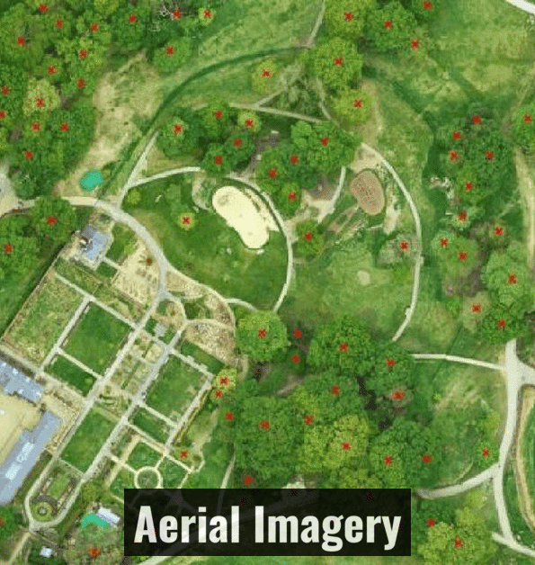
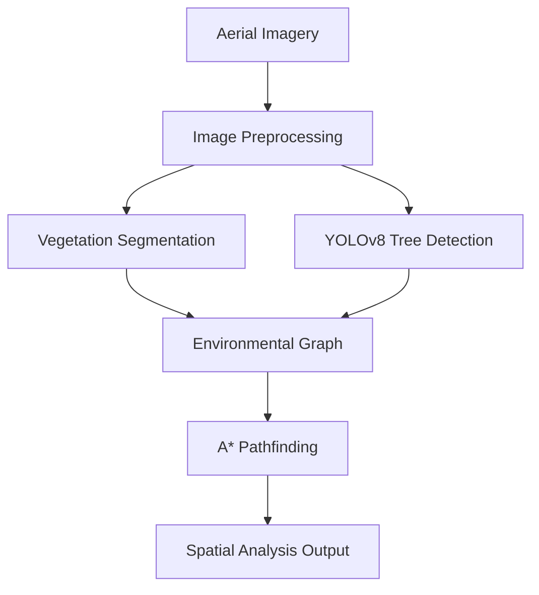
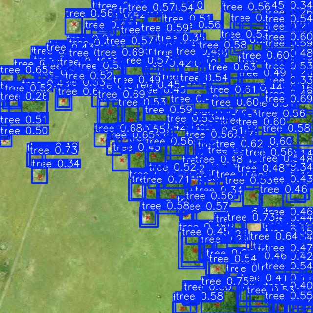
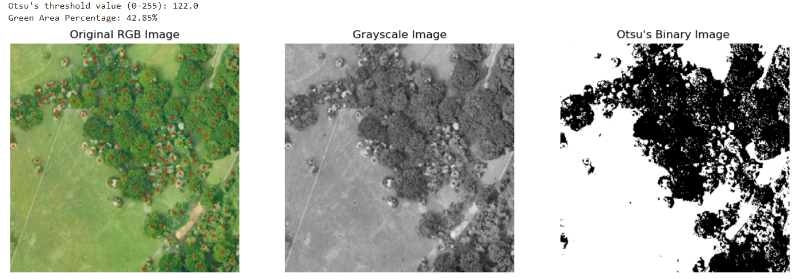
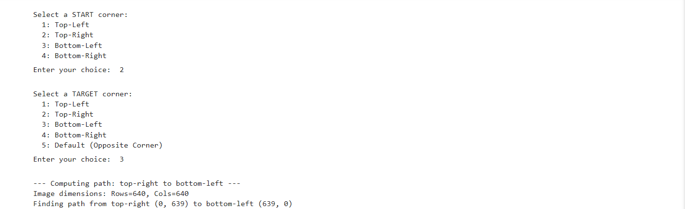
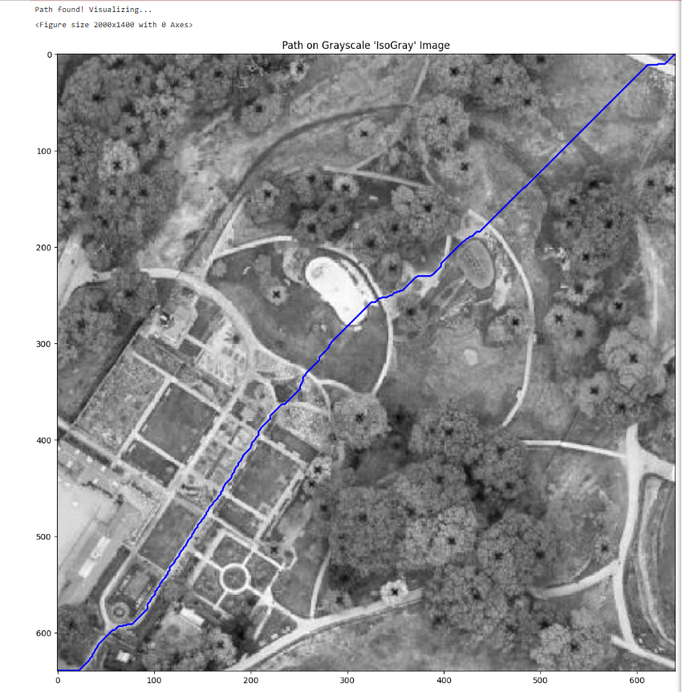
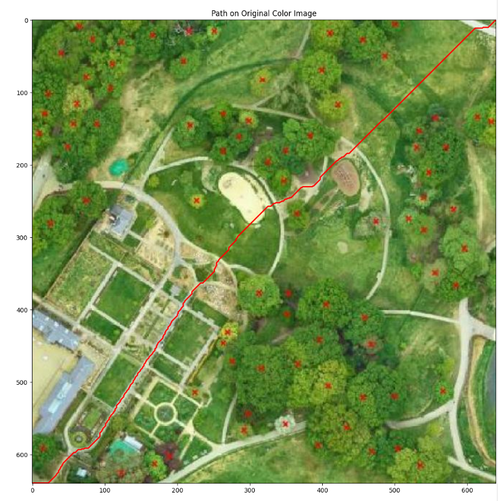

# 🌲 Dendrix

### AI Environmental vision & Spatial Analysis 

<p align="center">


</p>


---

## 🌍 Overview

**Dendrix** is a computer vision framework for automated forest inventory, vegetation analysis, and environmental route optimization using aerial imagery.

The framework combines **deep learning**, **image segmentation**, and **graph-based pathfinding** to transform aerial imagery into structured environmental information for analysis and route planning.

### 🎥 Demo

<p align="center">

</p>


## 🌱 Why Dendrix?

Forest inventory and vegetation analysis often rely on manual interpretation of aerial imagery, which can be time-consuming and difficult to scale. Dendrix streamlines this workflow by combining deep learning, classical image processing, and graph-based pathfinding into a single pipeline.

By automatically detecting tree canopies, segmenting vegetation, and generating graph representations suitable for route planning, Dendrix provides a foundation for applications such as forest inventory, ecological surveying, and UAV-assisted environmental monitoring.

### Key Capabilities

- 🌳 Tree detection using **YOLOv8**
- 🌿 Vegetation segmentation with OpenCV
- 🛰  Graph construction for route planning
- 🗺 Lowest-cost route computation using **A*** algorithm
- ⚡ GPU-accelerated inference with PyTorch
- 🧩 Modular pipeline for environmental analysis

---

# 🏗 System Architecture



---

# 🚀 Core Features

## 🌳 Automated Tree Detection

A custom-trained **YOLOv8** model detects individual tree canopies from aerial imagery.

**Features**

- Tree canopy detection
- Automated tree counting
- Bounding box localization
- Confidence scoring
- GPU-accelerated inference


Model:

```
models/
└── best.pt
```

---

## 🌿 Vegetation Segmentation

Vegetation regions are extracted from RGB aerial imagery using classical image processing techniques.

The pipeline applies RGB-based preprocessing followed by Otsu thresholding to separate vegetation regions from non-vegetation areas.

**Pipeline**

- RGB image preprocessing
- Otsu thresholding
- Binary mask generation
- Canopy extraction

---

## 🗺 Spatial Pathfinding

Segmented vegetation maps are converted into weighted graphs for route planning.

### Graph Generation

The vegetation mask is transformed into a grid graph where:

- Nodes represent valid spatial cells
- Edges represent possible movements
- Weights represent traversal cost

The A* algorithm finds the lowest-cost path while considering factors such as:

- Vegetation density
- Obstacles
- Distance

## Route Optimization

A* performs heuristic-based path search to generate optimized environmental routes for navigation and spatial analysis.

# 📁 Repository Structure

```text
Dendrix/

│
├── assets/
│   ├── dendrix_demo.gif
│   ├── tree_detection.jpg
│   ├── vegetation_segmentation.jpg
│   ├── path_finding_1.jpg
│   ├── path_finding_2.jpg
│   └── path_finding_3.jpg
│
├── dataset/
│   ├── data.yaml
│   ├── README.md
│   └── roboflow.md
│
├── models/
│   └── best.pt
│
├── notebooks/
│   ├── BinaryImageThresholding.ipynb
│   ├── ModelTraining.ipynb
│   └── StructuredOptimalPathing.ipynb
│
├── sample_images/
│   ├── aerial_image_1.jpg
│   └── aerial_image_2.jpg
│
├── requirements.txt
├── LICENSE
├── README.md
└── .gitignore

```

---

# ▶️ Usage

The project is organized into three independent notebooks, each corresponding to a stage of the Dendrix processing pipeline.

| Notebook | Purpose | Outputs |
|----------|---------|---------|
| `ModelTraining.ipynb` | Train and evaluate the YOLOv8 tree detection model | Trained model weights, evaluation metrics, detection visualizations |
| `BinaryImageThresholding.ipynb` | Generate vegetation masks using image processing | Binary vegetation masks, segmented canopy regions, vegetation coverage |
| `StructuredOptimalPathing.ipynb` | Construct weighted graphs and compute optimal routes using A* | Environmental graph, weighted paths, A*-optimized route visualization |

Each notebook can be executed independently depending on the desired stage of the workflow.

---

# 🛠 Technology Stack

| Category | Technologies |
|----------|--------------|
| 🧠 Deep Learning | YOLOv8, PyTorch |
| 👁 Computer Vision | OpenCV, scikit-image |
| 📊 Scientific Computing | NumPy, Matplotlib |
| 🛰 Dataset Management | Roboflow |
| 💻 Language | Python 3.10+ |
| 🗺 Path Planning | A* Search Algorithm |

---
## Requirements

- Python 3.10+
- NVIDIA GPU recommended for faster YOLOv8 inference

# ⚙️ Installation

## Clone the Repository

```bash
git clone https://github.com/vectorinfinity/Dendrix.git

cd Dendrix
```

---

## Install Dependencies

```bash
pip install -r requirements.txt
```

---

# ⚡ Quick Start

The complete Dendrix pipeline can be executed in the following notebooks:

1. `ModelTraining.ipynb`  
   - Train and evaluate the YOLOv8 tree detection model

2. `BinaryImageThresholding.ipynb`  
   - Generate vegetation masks using image processing

3. `StructuredOptimalPathing.ipynb`  
   - Build environmental graphs and compute optimized routes using A*
---


## Tree Detection

The trained YOLOv8 model weights are included:

```
models/best.pt
```


Run inference:


```python
from ultralytics import YOLO


model = YOLO(
    "models/best.pt"
)


results = model(
    "sample_images/aerial_image_1.jpg"
)


results[0].show()
```


Output:

- Tree bounding boxes
- Detection confidence
- Tree locations


---

# 📊 Dataset


The detection model was trained using aerial imagery annotated for tree canopy detection.


| Property | Details |
|-|-|
| Dataset Source | Roboflow |
| Task | Object Detection |
| Format | YOLOv8 |
| Classes | Tree |


Dataset files:

```
dataset/

├── data.yaml
├── README.md
└── roboflow.md
```

---

# 📊 Pipeline Results

Dendrix processes aerial imagery through three primary stages:

1. Tree detection
2. Vegetation segmentation
3. Spatial path optimization

The following outputs demonstrate the complete pipeline.

---

# 🌳 Tree Detection Results

The YOLOv8 detection model identifies individual tree canopies from aerial imagery.

<p align="center">

</p>

### Generated Outputs

- Individual tree localization
- Bounding boxes
- Detection confidence scores
- Automated tree counting

---

# 🌿 Vegetation Segmentation Results

The segmentation pipeline extracts vegetation regions from aerial images using image processing techniques.

<p align="center">

</p>

### Generated Outputs

- Binary vegetation masks
- Canopy regions
- Vegetation coverage representation


---

# 🗺 Spatial Path Optimization Results

Segmented environmental data is transformed into a graph representation for route planning.

<p align="center">
<br>
<br>

</p>

### Generated Outputs

- Environmental graph structure
- Weighted navigation paths
- Lowest-cost route calculation using A*
- Optimized trajectories

---

# 📈 Model Performance

## YOLOv8 Detection Metrics

### Model Performance Summary

| Metric | Score | 
| :--- | :--- | 
| **Precision** | **0.832** |
| **Recall** | **0.768** | 
| **mAP@50** | **0.797** | 
| **mAP@50-95**| **0.344** |
| **F1 Score** | **0.799** |

---

> **Evaluation Insight:** 
> The model demonstrates strong tree canopy detection performance, achieving an F1 score of 0.799 and mAP@50 of 0.797. The lower mAP@50-95 reflects the challenge of precise bounding-box localization in overlapping natural canopy structures.
---

## Experimental Environment

The project was developed and tested using:

- Python 3.10+
- PyTorch
- YOLOv8
- NVIDIA RTX 3050 GPU
---


# 🌍 Applications

Dendrix can be adapted for multiple environmental monitoring and spatial analysis scenarios.

Potential applications include:

- 🌲 Automated forest inventory
- 🛰 UAV-based environmental monitoring
- 🌱 Vegetation mapping
- 🗺 Conservation planning
- 🚜 Smart forestry systems
- 🌍 Ecological surveying
- 🤖 Autonomous environmental navigation
- 📍 Spatial accessibility analysis

---

# 🔮 Future Development

Future improvements planned for Dendrix include:

- [ ] Semantic segmentation models
- [ ] Multi-species tree classification
- [ ] GIS data integration
- [ ] Elevation-aware path planning
- [ ] Real-time UAV inference
- [ ] Large-scale satellite imagery processing
- [ ] Interactive visualization dashboard
- [ ] Improved environmental graph modeling

The current framework provides a foundation for extending computer vision workflows with semantic segmentation, GIS integration, and real-time UAV processing.


---

# 📜 License

This project is licensed under the MIT License.

See the `LICENSE` file for more details.


---

# 📬 Contact

For collaboration, research discussions, or technical contributions:

- Open an issue 
- Submit a pull request
- Connect through GitHub discussions or profile

---

<p align="center">

**Dendrix**  
*Computer Vision • Environmental Mapping • Spatial Analysis*

Built with Python, PyTorch, OpenCV, and YOLOv8.

</p>
